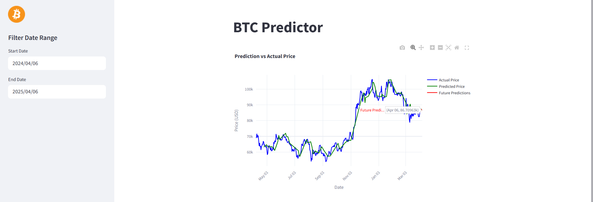

# BTC Predictor

The prediction model is trained on comprehensive Bitcoin market data spanning from April 29, 2013 until yesterday at 12 AM (last_date.txt) which is updated everyday in the same hour. The pipeline includes data processing, model training, evaluation, and visualization of predictions through an interactive Streamlit dashboard. 

This long-term training period allows the model to capture various market conditions, including bull and bear markets, volatility spikes, and long-term trends, resulting in more robust and reliable price predictions.

## Key Features

- **Predictions**: 
  - The model provides predictions for the next 5 days, helping users make informed trading decisions
  - Predictions are made using XGBoost regression with optimized hyperparameters

- **Visualizations**: 
  - Interactive Streamlit interface for analysis
  - Dynamic charts showing both historical prices and future predictions with custom date ranges and downloading options.

- **Metrics**: 
  - Detailed evaluation of model accuracy including Mean Squared Error (MSE), Mean Absolute Error (MAE), and R² Score
  - Example: Current MSE of $172.70 indicates the average squared difference between predicted and actual prices

- **Updates**: 
  - Daily price data updates from Coinpaprika API
  - Automated data processing and model retraining pipeline with Github workflows at 1 AM UTC



## Data Structure:
  - time_open: Opening time of each trading candle (1-hour intervals)
  - open: Opening price at the start of each hour
  - high: Highest price reached during the hour
  - low: Lowest price reached during the hour
  - close: Closing price at the end of each hour
  - volume: Total trading volume (in USD) during the hour
  - market_cap: Market capitalization of Bitcoin at the hour's close

## Setup and Installation

1. Create a virtual environment:
```bash
python -m venv venv
source venv/bin/activate  # On Windows: venv\Scripts\activate

2. Install dependencies:
```bash
pip install -r requirements.txt

3. Run the dashboard:
```bash
streamlit run src/dashboard.py


